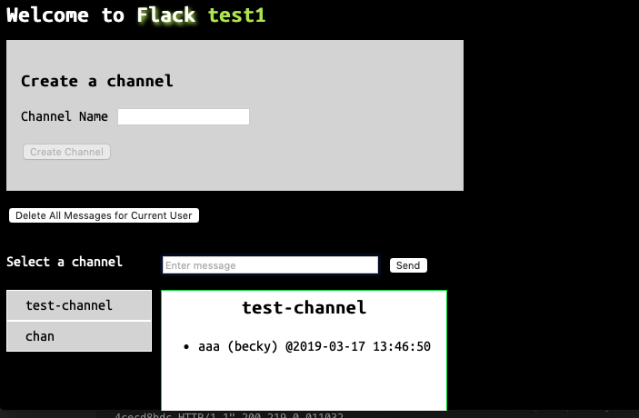

# Project 2

## Web Programming with Python and JavaScript
### Flack - Socket IO Messaging App Using Flack

The user is prompted to enter a **display name** to begin.  Once a display name has been entered it
is cached in local storage.  
The user can then create a **channel** and once the channel is selected by clicking on it, the user can begin posting **messages*.   

Messages are displayed with the following information: `message` `display name` `date time`.  

See the picture below for an active Flack display.

### Features
1. The user is prevented from enter empty data for the display name, channel, or message.  
1. The browser remembers displayname and last channel selected.
1. A Button is provided for Deleting all message provided by the current user based on display name. 

### Requirements

1. Display Name: When a user visits your web application for the first time, they should be prompted to type in a display name that will eventually be associated with every message the user sends. If a user closes the page and returns to your app later, the display name should still be remembered.
1. Channel Creation: Any user should be able to create a new channel, so long as its name doesn’t conflict with the name of an existing channel.
1. Channel List: Users should be able to see a list of all current channels, and selecting one should allow the user to view the channel. We leave it to you to decide how to display such a list.
1. Messages View: Once a channel is selected, the user should see any messages that have already been sent in that channel, up to a maximum of 100 messages. Your app should only store the 100 most recent messages per channel in server-side memory.
1. Sending Messages: Once in a channel, users should be able to send text messages to others the channel. When a user sends a message, their display name and the timestamp of the message should be associated with the message. All users in the channel should then see the new message (with display name and timestamp) appear on their channel page. Sending and receiving messages should NOT require reloading the page.
1. Remembering the Channel: If a user is on a channel page, closes the web browser window, and goes back to your web application, your application should remember what channel the user was on previously and take the user back to that channel.
1. Personal Touch: Add at least one additional feature to your chat application of your choosing! Feel free to be creative, but if you’re looking for ideas, possibilities include: supporting deleting one’s own messages, supporting use attachments (file uploads) as messages, or supporting private messaging between two users.
